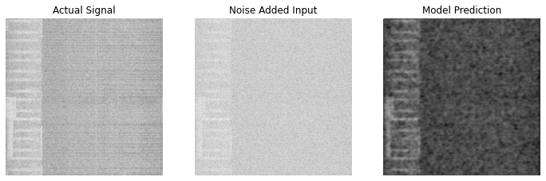
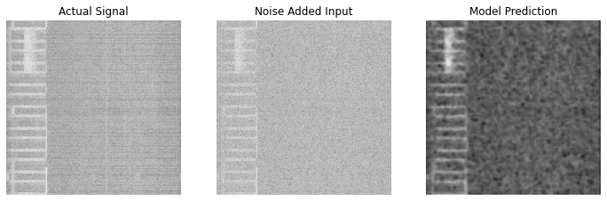
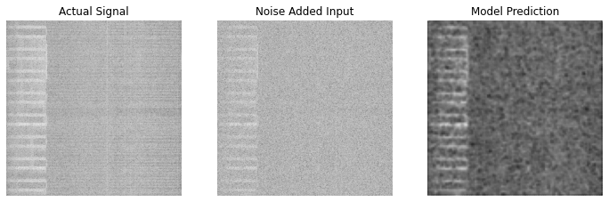
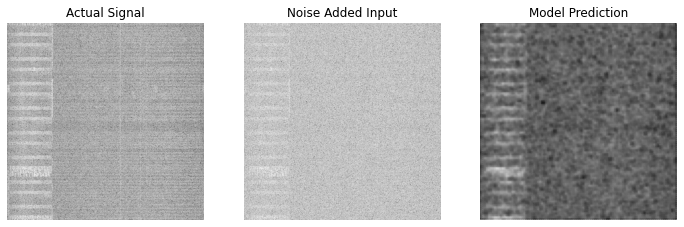

# bigSig : Machine Learning + SDR Experiments 


## Data Collection 

Done using [data_collection.py](./data_collection.py) and PLUTOSDR. 
__Sampling Parameters__

``` python
sample_rate = 40e6
center_freq = 433e6
num_samps = 40000 
```

## Trials and Tribulations 

### m1 - Manual AWGN Noise Imputation 
Manually adding AWGN noise in python as a substitute for a real world noisy signal 
- [Ref](https://pysdr.org/content/noise.html)<br/>
- [Preprocessing Notebook](./m1_preprocessing.ipynb)<br/>
- [AutoEncoder Training Notebook](./m1_train_colab.ipynb) <br/>

#### Outputs `run 1 : small poc with 190 training sample and 10 test samples`






#### Conclusions? 
Idk yet but 
- the model output does make the difference between the floor and signal more apparent 
- the model sometimes tries to create signals on the right (bias due to training as samples similar looking)
