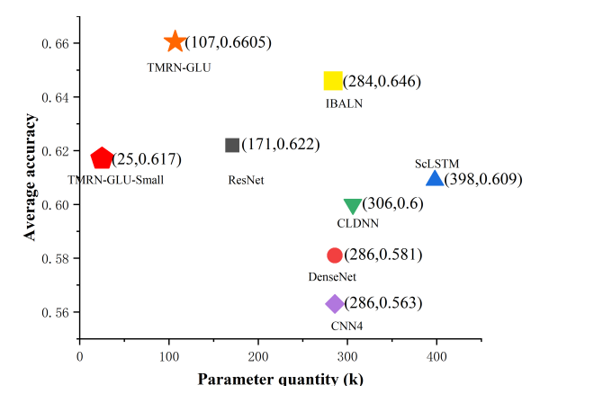

# bigSig : Machine Learning + SDR Experiments 


## Data 

#### Self Collected  
Done using [data_collection.py](./data_collection.py) and PLUTOSDR. 
__Sampling Parameters__

``` python
sample_rate = 40e6
center_freq = 433e6
num_samps = 40000 
```
#### Online Datasets 
- [deepsig.ai](https://www.deepsig.ai/datasets)

# Trials and Tribulations 


## experiment 1 - Denoising using Convolution AutoEncoder 
> Manual AWGN Noise Imputation 

Manually adding AWGN noise to PlutoSDR signals in python as a substitute for a real world noisy signal 
- [Reference for Noise Addition](https://pysdr.org/content/noise.html)<br/>
- Data collected with 70 gain. 
- [Preprocessing Notebook](./m1_preprocessing.ipynb)<br/>
- [AutoEncoder Training Notebook (Colab Pro GPU + High RAM Instance)](./m1_train_colab.ipynb) <br/>

#### Outputs `run 1 : small poc with 190 training sample and 10 test samples`


#### Conclusions? 
Idk yet but 
- the model output does make the difference between the floor and signal more apparent 
- the model sometimes tries to create signals on the right (bias due to training as samples similar looking)
- [ ] Try on totally random signals on which no training done (maybe different encoing even)

------

## experiment 2 - AMR (Automatic Modulation Recognization) using CNNs 
Using DL models to detect modulation scheme at various SNR's <br/>
__Current SOTA [1]__

- Best case : Attention based transformers 
- Meh case : CNNs 


----------
## Some Nice References 
- [Force Sharpening Component](https://medium.com/mlearning-ai/image-deblurring-using-convolutional-autoencoders-deep-learning-project-tutorial-329f87a4c6ad)
- [AMR Reference 1 (2019)](https://erichizdepski.wordpress.com/2019/05/23/using-machine-learning-to-categorize-radio-signals/) 
- [AMR Reference 2 (Git Classification Notebook)](https://github.com/radioML/examples/blob/master/modulation_recognition/RML2016.10a_VTCNN2_example.ipynb)
- [ResNet from scratch](https://www.kaggle.com/code/mishki/resnet-keras-code-from-scratch-train-on-gpu)

## Repo References 
- __1__. TMRN-GLU: A Transformer-Based Automatic Classification Recognition Network Improved by Gate Linear Unit